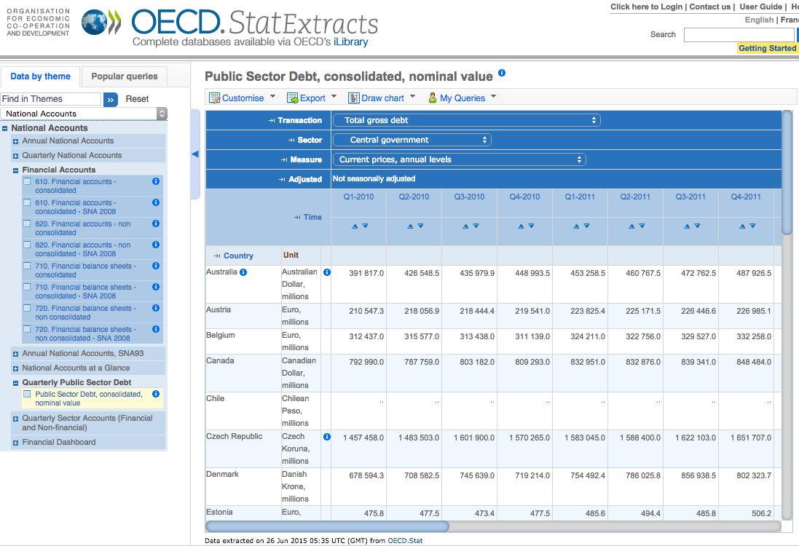
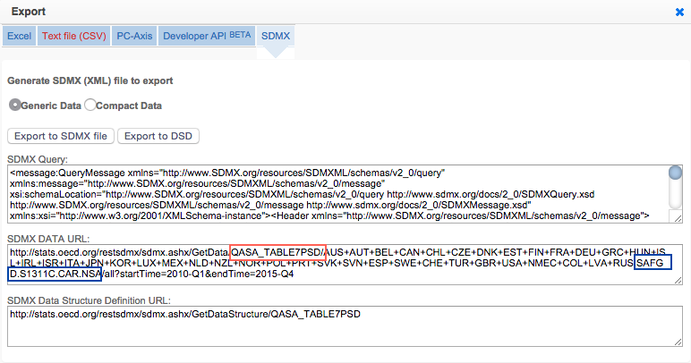

# oecdr: Download and extract data from the [OECD](https://stats.oecd.org) into R.

Version: 0.1.0 [](https://travis-ci.org/christophergandrud/oecdr)


## Install

```{S}
devtools::install_github('christophergandrud/oecdr')
```

## Use

OECD Statistics are arranged as **indicators** in **tables**. For example,
the *Total gross debt* indicator is in the *Public Sector Debt, consolidated,
nominal value* table:



To download this data into R we need both the **indicator** and **table**
identifiers. To find these click on `Export` then `SDMX (XML)`. A window
like this should pop up:



The information we need is in the "SDMX DATA URL" field. I've highlighted the
table ID with the red box (`QASA_TABLE7PSD`) and the indicator ID with the blue
box (`SAFGD.S1311C.CAR.NSA`).

> Hint: The table ID will be surrounded by forward slashes (`/`). The indicator
ID will be proceeded by a `.` and followed by a `/`.

We can enter this information into `oecd` and download the data into R. You
can download multiple indicators from the same table with the same `oecd`
call. For example:

```{S}
qrt_public_debt <- oecdr::oecd(table = 'QASA_TABLE7PSD',
                        indicator = c('SAF2LXT.S1311C.PCTGDPA.NSA',
                        'SAFGD.S1311C.CAR.NSA'))

head(qrt_public_debt)

  iso3c    time SAF2LXT.S1311C.PCTGDPA.NSA SAFGD.S1311C.CAR.NSA
1   AUS 2000-Q1                          0             197175.0
2   AUS 2000-Q2                          0             198660.5
3   AUS 2000-Q3                          0             195187.8
4   AUS 2000-Q4                          0             205515.9
5   AUS 2001-Q1                          0             203152.5
6   AUS 2001-Q2                          0             209870.5
```

Here is another example that downloads Gross domestic product (expenditure approach current prices, millions):

```{S}
gdp <- oecd(table = 'SNA_TABLE1', indicator = 'B1_GE.CPC',
           start = 2000, end = 2012)
```
